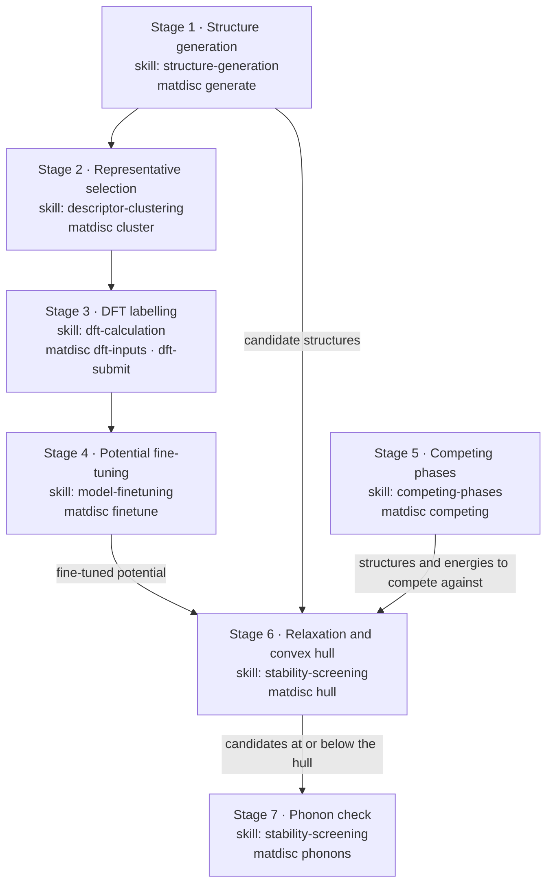

# materials-discovery-skills

`matdisc` is a Python package for the computational workflow behind
[arXiv:2606.10251](https://arxiv.org/abs/2606.10251), *Robust AI-Driven Discovery of Electronic
Metal Phosphide Semiconductors*: generate candidate structures for a chemical system, pick a
representative subset worth a DFT calculation, fine-tune a machine-learning interatomic potential
on those DFT labels, harvest the competing phases of the system from the Materials Project, and
screen the candidates for thermodynamic (convex hull) and dynamical (phonon) stability. `skills/`
carries the same seven stages as `SKILL.md` files — the documentation layer an agent reads to
decide which command to run. This repository is the tooling only: no candidate list, no
trained checkpoint and no calculation output from the paper ships here. Ba-Cd-P is the worked
example throughout, and structures, compositions, phase diagrams and VASP inputs all go through
[pymatgen](https://github.com/materialsproject/pymatgen).

The paper expands its candidate space two ways, by ICSD-derived Wyckoff-site substitution and by
conditional generation with MatterGen. Only the MatterGen route is implemented here.

## The pipeline



`matdisc pipeline` runs any subset of these seven stages from one YAML configuration file; that is
what the `unified-workflow` skill describes. Stage by stage, with inputs, outputs and the mapping
onto the paper's workflow: [`docs/pipeline.md`](docs/pipeline.md).

## What runs where

| Stage | Command | Needs |
|---|---|---|
| Convex hull | `matdisc hull` | Nothing beyond the base install: no network, no credentials, no GPU |
| Phonon check | `matdisc phonons` | `--calculator emt` runs offline for the handful of elements ASE's EMT covers; anything else needs DeePMD-kit and a checkpoint |
| VASP inputs | `matdisc dft-inputs` | Base install. Real POTCARs need `$PMG_VASP_PSP_DIR`; without it a `POTCAR.spec` listing the symbols is written instead |
| Job submission | `matdisc dft-submit` | `sbatch` on the machine you run it on; the script calls `$VASP_CMD`, which is your own licensed VASP |
| Competing phases | `matdisc competing` | Network and a Materials Project key in `$MP_API_KEY` |
| Relax candidates and place them on the hull | `matdisc screen -s <candidates> --competing-structures <dir> -o <out>` | A calculator: `--calculator emt` runs offline for the elements EMT covers, otherwise DeePMD-kit and a checkpoint |
| Relaxation and descriptors | `matdisc cluster`, and the `screening` stage of `matdisc pipeline` | DeePMD-kit, a DPA-3 checkpoint (`$DPA3_MODEL_PATH`), GPU strongly recommended; `maml` for the DIRECT sampling |
| Structure generation | `matdisc generate` | MatterGen installed and on `PATH`, plus its checkpoint; GPU |
| Fine-tuning | `matdisc finetune` | DeePMD-kit, a pretrained checkpoint, finished DFT calculations, GPU |
| Everything from a config file | `matdisc pipeline` | Whatever the stages you list need |

Limitations worth knowing before you start:

- **No calculations are run for you.** The DFT stage writes inputs and a SLURM script and can
  submit it. VASP itself is commercial software you license and install yourself; no POTCAR files
  are included and none may be redistributed.
- **The machine-learning backends are optional extras** and are imported inside the functions that
  use them, so `import matdisc` and every subcommand's `--help` work without them. They are large,
  GPU-oriented and versioned independently of this package. MatterGen is not even that: it is
  never imported, only run as a console script you install yourself.
- **Competing-phase energies and candidate energies must be on one scale.** By default the
  screening stage relaxes both sides with the same calculator for exactly this reason; reading
  energies straight from the harvested Materials Project table is possible but has to be asked for.
- **Nothing here reproduces the paper's results.** The paper reports 3,574 previously unreported
  stable phosphide structures and 196 semiconductors with HSE06 gaps between 0 and 3.0 eV; running
  this package end to end requires the same checkpoints, cluster time and DFT settings that
  produced them.

## Install

From a clone of this repository:

```bash
uv pip install -e .
```

`pip install -e .` works the same way. The package needs Python 3.11 or newer — pymatgen and
mp-api both require it — and every command in this README was run on 3.11. Optional backends are
declared as extras:

| Extra | Pulls in | For |
|---|---|---|
| `mlip` | deepmd-kit, dpdata | descriptors, relaxation, phonons, fine-tuning |
| `clustering` | maml, scikit-learn | DIRECT representative selection |
| `dev` | pytest, ruff, black | tests and linting |

Install one with `uv pip install -e ".[mlip]"`. Only the base install is exercised by the commands
in this README; the extras pull in large, hardware-specific packages that are best installed
against your own CUDA and compiler stack. MatterGen is not an extra: it is installed from its own
repository (<https://github.com/microsoft/mattergen>) and is driven through its
`mattergen-generate` console script rather than imported, so nothing here can pull it in for you.

Two environment variables are read when the corresponding stage runs, and nothing is stored in
this repository: `MP_API_KEY` (a Materials Project key, issued at
<https://materialsproject.org/api>) and `DPA3_MODEL_PATH` (your machine-learning potential
checkpoint). `VASP_CMD` and `PMG_VASP_PSP_DIR` are read on the machine where VASP actually runs.

## Five seconds, offline

```console
$ matdisc hull --demo
Offline demo: three Ba-Cd-P candidates against a small table of competing phases.
            id composition  e_above_hull  is_stable               decomposition
toy-below-hull       BaCdP -8.333333e-02       True  0.8333*Ba(CdP)2; 0.1667*Ba
toy-above-hull       BaCdP  1.166667e-01      False  0.8333*Ba(CdP)2; 0.1667*Ba
   toy-on-hull    Ba2Cd2P3 -1.110223e-16       True 0.7143*Ba(CdP)2; 0.2857*BaP

2 of 3 candidate(s) at or below the hull
(stable when e_above_hull <= 1e-06 eV/atom)
```

Progress goes to standard error, results to standard output. The three candidates are synthetic
round numbers, not calculated values, and they exercise the three outcomes of the stability test.
The third one sits exactly on the tie-line between two hull phases, which is why its energy above
the hull is zero to within the rounding of the hull solve — and why the criterion is `<=` and not
`<`. `python examples/00_quickstart.py` is the same check through the Python API, printing the
competing-phase table as well.

Your own hull, from two CSV files:

```bash
matdisc hull --candidates candidates.csv --competing competing_phases.csv -o hull.csv
```

Both tables need a `composition` column and a per-atom energy column (`energy_per_atom` by
default); the candidates also need an `id`. `matdisc competing -c Ba-Cd-P -o runs/BaCdP` writes a
competing table in exactly that shape, and a harvested Ba-Cd-P one ships under `examples/data/` —
its energies are formation energies, so use it with `--energy-column formation_energy_per_atom`.

## Stability criterion

A candidate counts as **stable when `e_above_hull <= tolerance`**, with the tolerance defaulting to
`1e-6` eV/atom and settable with `--tolerance`. The default admits a phase sitting exactly on the
hull, which is the usual convention, and absorbs the rounding of the hull solve; a strict `< 0`
test reports an on-hull phase as unstable. Raise it (`--tolerance 0.05`) to keep near-hull
candidates for a later, more expensive check.

Energies above the hull come from
`pymatgen.analysis.phase_diagram.PhaseDiagram.get_decomp_and_e_above_hull`. Every formula is parsed
by `pymatgen.core.Composition`, so a nested formula such as `Ba(CdP)2` keeps its multipliers.

## Layout

```
src/matdisc/        the package: common/ generation/ clustering/ dft/ finetune/
                    competing/ screening/ pipeline/, plus the matdisc console script
skills/             seven SKILL.md files, one per stage, plus unified-workflow
examples/           runnable examples, starting with the offline quickstart
tests/              unit tests; network and GPU tests are marked
docs/               pipeline.md and the provenance of the bundled data
tools/              release_check.py, a fail-closed pre-publication scanner
```

## Data

Two frozen snapshots of the Ba-Cd-P worked example ship here: three structures under
`examples/data/structures/` (Ba, BaCd, BaCd2) and a competing-phase table under `examples/data/`.
Both are Materials Project data, licensed
[CC BY 4.0](https://creativecommons.org/licenses/by/4.0/); their identifiers, their provenance and
the required citation are in [`docs/data/README.md`](docs/data/README.md). Neither is current: they
are a frozen snapshot from an earlier harvest whose retrieval date and database version were not
recorded.

## Authors and citing

Developed by Benhao Zhu and Jiahao Xie. If you use this software, cite the paper it was abstracted from:

> B. Zhu, M. Faizan, Z. Li, W. Li, F. Ren, J. Xie and L. Zhang, "Robust AI-Driven Discovery of
> Electronic Metal Phosphide Semiconductors", [arXiv:2606.10251](https://arxiv.org/abs/2606.10251).

`CITATION.cff` carries the same reference in machine-readable form, so GitHub's *Cite this
repository* button yields it.

## Licence

MIT — see [`LICENSE`](LICENSE). Third-party software this package drives, the licences it is
distributed under, and the attribution required for the bundled Materials Project data are listed
in [`NOTICE.md`](NOTICE.md).

## Acknowledgements

This package is a thin layer over other people's software and does not reimplement any of it:
[pymatgen](https://github.com/materialsproject/pymatgen) and
[mp-api](https://github.com/materialsproject/api) for structures, compositions, phase diagrams,
VASP input and output, and Materials Project access; [ASE](https://gitlab.com/ase/ase) for
relaxation and phonons; [MatterGen](https://github.com/microsoft/mattergen) for conditional
structure generation; [DeePMD-kit](https://github.com/deepmodeling/deepmd-kit) and
[dpdata](https://github.com/deepmodeling/dpdata) for the DPA-3 potential and its training data;
[maml](https://github.com/materialsvirtuallab/maml) for DIRECT sampling.
